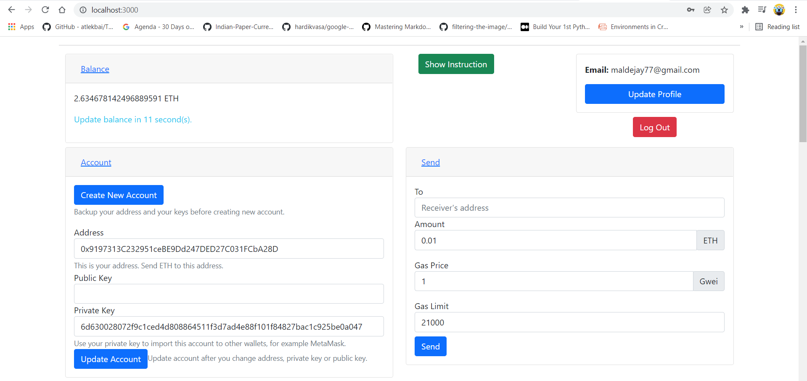
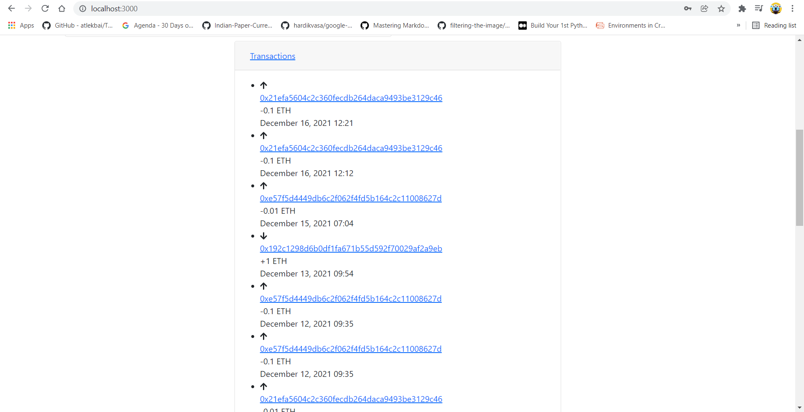
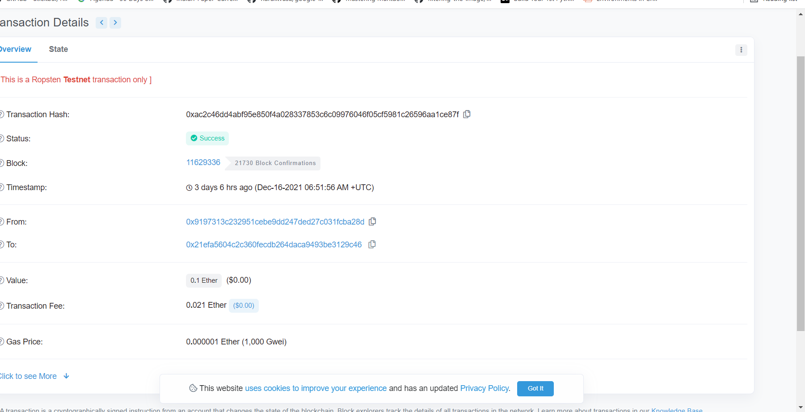

# Crypto-Ether-Wallet

# Screenshots
## Landing Page

## All transactions from this account (data from etherescan api)

## Single Transaction


## Technical Aspect
* Node.js ( Javascript Runtime )
* React.js ( Frontend Library )
* Firebase ( For Authentication )

## API Used
* Etherscan
* Infura

## For Running Back-End
```bash
cd Back-End
npm install
node server.js
```

## For Running Front-End
```bash
cd Front-End
npm install
npm start
```
